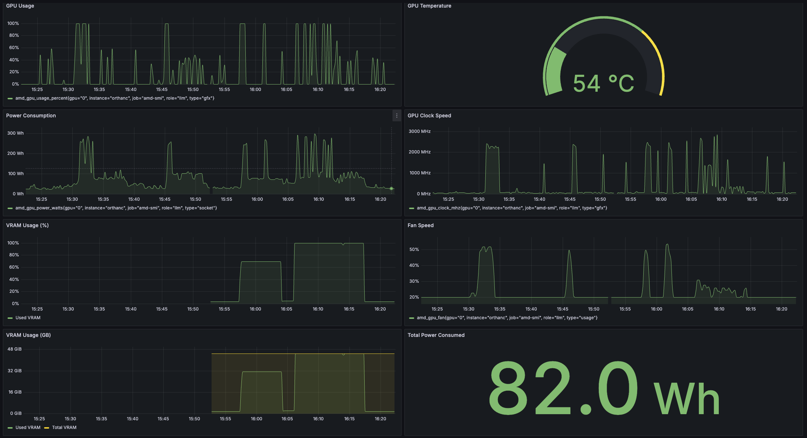

# AMD SMI Exporter

A Prometheus exporter for AMD GPU metrics using the `amd-smi` tool. The goal was to get some AMD GPU visualization to Grafana.

## Grafana Dashboard



The included Grafana dashboard (`grafana/amd_gpu_dashboard.json`) provides comprehensive monitoring of your AMD GPUs with the following features:

- Real-time GPU metrics
- Dark theme optimized visualization
- Multiple panels tracking various GPU metrics
- Tagged with 'gpu' and 'amd' for easy discovery
- Prometheus data source integration

To use the dashboard:
1. Import the JSON file from `grafana/amd_gpu_dashboard.json` into your Grafana instance
2. Ensure your Prometheus data source is configured and named 'prometheus'
3. The dashboard will automatically start displaying metrics from your AMD GPUs

## Prerequisites

- Go 1.21 or later
- AMD GPU with `amd-smi` tool installed

## Installation

Clone the repository and build the binary:

```bash
git clone https://github.com/jkoudela/amd-smi-exporter.git
cd amd-smi-exporter
make build
```

Alternatively, you can use the provided install script to deploy to a remote Linux host with IP and username using ssh:

```bash
./install.sh <target-host> root
```

## Building

The project includes a Makefile with the following targets:

### Build for Linux (amd64)
```bash
make build
```
This will create a Linux binary named `amd-smi-exporter` that you can deploy to your Linux machine.

### Clean build artifacts
```bash
make clean
```

## Usage

```bash
./amd-smi-exporter [flags]
```

### Flags

- `--web.listen-address`: Address to listen on for web interface and telemetry (default ":9360")
- `--web.telemetry-path`: Path under which to expose metrics (default "/metrics")

## Metrics

The exporter provides the following metrics:

- `amd_gpu_usage_percent`: GPU usage metrics in percent
  - Graphics engine usage (gfx)
  - Memory controller usage (umc)
  - Multimedia engine usage (mm)
  - Video codec engine usage (vcn)
- `amd_gpu_power_watts`: GPU power consumption in watts
  - Socket power consumption
- `amd_gpu_temperature_celsius`: GPU temperature in celsius
  - Edge temperature
  - Hotspot temperature
  - Memory temperature
- `amd_gpu_clock_mhz`: GPU clock speeds in MHz
  - Graphics engine clock (gfx)
- `amd_gpu_memory_bytes`: GPU memory usage in bytes
  - Reports VRAM (total, free, used)
  - Reports visible VRAM (total, free, used)
  - Reports GTT memory (total, free, used)
- `amd_gpu_fan`: GPU fan metrics
  - Speed percentage
  - RPM
  - Usage percentage
- `amd_gpu_voltage_mv`: GPU voltage in millivolts
  - Graphics engine voltage (gfx)
  - Memory voltage
  - SOC voltage
- `amd_gpu_ecc_errors_total`: GPU ECC error counts
  - Correctable errors
  - Uncorrectable errors

Each metric includes appropriate labels to identify the GPU and metric type.

## Prometheus Configuration

Add the following to your `prometheus.yml`:

```yaml
scrape_configs:
  - job_name: 'amd_gpu'
    static_configs:
      - targets: ['localhost:9360']
```

